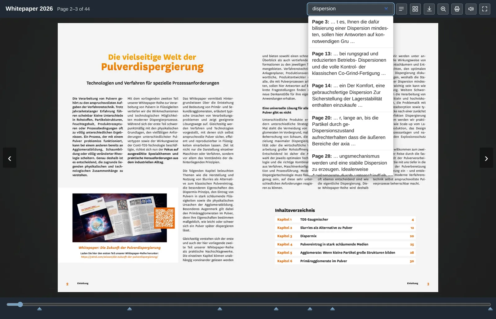

# nt_flippdf – page-flip editions from PDF files

Turns a PDF into a page-flip edition held in a **self-contained directory**:
page images, thumbnails, full-text search, download – delivered as static files,
with no TYPO3 involved at runtime. An edition therefore keeps working unchanged,
whatever happens to the website around it.

Manual: **[docs.netthinks.com/nt-flippdf](https://docs.netthinks.com/nt-flippdf/)** ·
Changes: **[CHANGELOG.md](CHANGELOG.md)**


<table>
<tr>
<td width="50%"><br><em>Full-text search across the whole edition</em></td>
<td width="50%"><br><em>Page overview to jump straight to a page</em></td>
</tr>
</table>

*Deutsche Fassung dieser Seite: [weiter unten](#nt_flippdf--blätterbare-pdf-ausgaben).*

## Requirements

**Ghostscript** (`gs`) and **ImageMagick** (`convert` or `magick`) must be
available on the server. `pdfinfo` from the poppler package is optional and only
speeds up counting the pages.

## Usage

In the backend under **File → Page-flip editions**: build editions, view them,
maintain the table of contents, refresh the viewer, delete.


On the command line:

```bash
vendor/bin/typo3 flippdf:build <path/to.pdf> <slug> \
    --titel "Title above the viewer" \
    --sprache de \
    [--download https://example.org/file.pdf] \
    [--ohne-download] \
    [--farbe-leiste "#1f2933"] [--farbe-akzent "#ec6602"]
```

### The add-on package

**[nt_flippdf_pro](https://www.netthinks.com)** extends this package through its
extension points and adds what a gated whitepaper needs: a preview edition
beside the full one, an unguessable slug for the full edition, splitting double
pages, watermark, logo and background images, French and Chinese labels, linked
language editions, and counting of views and downloads.

Nothing of it is required here – the base package is complete on its own.
Details and licence: **[netthinks.com](https://www.netthinks.com)**.

### In use

**[ystral.com](https://ystral.com/wissen/wissensportal/whitepaper/die-vielseitige-welt-der-pulverdispergierung/)**
uses both packages for its whitepapers: a preview of the first pages on the
landing page, the full edition behind the registration.

To put an edition on a page, use the content element **Blätterbare Ausgabe**
(page-flip edition) – embedded or as a button. It works without an extra column
in `tt_content`; its settings live in the existing FlexForm field.

The edition ends up in `<basePath>/<slug>/` and is reachable at
`<baseUrl><slug>/`. Without `--download` the extension writes a smaller version
as `download.pdf` next to it and links it in the viewer.

After a change to the viewer, existing editions catch up without re-rendering
every page:

```bash
vendor/bin/typo3 flippdf:refresh [slug]
```

## What the viewer offers

Page flipping (arrow keys, buttons, dragging a corner, swiping), page slider
with chapter marks, full-text search, table of contents, page overview, zoom,
print, download, full screen, opening in its own window, a page-turn sound and a
language switch between linked editions.

**Every one of these can be switched off** – as a default in the extension
configuration, per edition in the backend module, and per content element. The
header buttons come in three flavours: text, icon only, or icon plus text.

Behind the book there can be a **background image** (seven motifs are shipped,
own folders can be added), and a **logo** at one of nine anchor points. A
**watermark** is rendered into the page images at build time, so it also appears
in the downloaded image.

## Settings

In the extension manager under `nt_flippdf`:

| Setting | Default | Meaning |
|---|---|---|
| `basePath` | `public/blaetterbar` | where editions are stored, relative to the project root or absolute |
| `baseUrl` | `/blaetterbar/` | the address that directory is served under |
| `pageWidth` | `1240` | width of the page images in pixels |
| `jpegQuality` | `80` | JPEG quality of the page images |
| `thumbWidth` | `200` | width of the thumbnails |
| `buildDownloadVersion` | `1` | create a smaller version for download |
| `downloadResolution` | `120` | resolution of that version in dpi |
| `protectFromIndexing` | `1` | writes an `.htaccess` with `X-Robots-Tag: noindex` into the storage directory |
| `pdfFolders` | – | which folders offer PDFs in the backend module |
| `logoFolders` | – | which folders offer logo images |
| `backgroundFolders` | – | additional folders with background images |
| `background`, `backgroundDim`, `backgroundFit` | – / `45` / `cover` | default background behind the book |
| `watermark*` | – | default watermark: text, colour, opacity, size, angle, tiling |
| `ui*` | on | which controls the viewer offers by default |

## Table of contents

PDFs rarely carry their bookmarks, and the tools to read them (`mutool`,
`pdftk`) are missing on many servers. The contents are therefore derived from
the page itself: `pdftotext -bbox-layout` provides the line heights, anything
clearly taller than the usual line counts as a heading, and multi-line titles
are merged. The suggestion can be corrected in the backend module.

## Search engines

While building, the extension writes an `.htaccess` with
`X-Robots-Tag: noindex, nofollow` into the storage directory, and every start
page carries a `noindex` in its head. The page embedding the edition is what
should be found – and gated material should only be reachable through the
intended route anyway. Under nginx the `.htaccess` has no effect; there the rule
belongs in the server configuration.

## Colours

Four values can be overridden per edition and end up as an inline style in
`index.html`: `--bar`, `--bar-text`, `--stage`, `--accent`. On the command line
those are `--farbe-leiste` and `--farbe-akzent`. In the backend module each
colour field has a picker with suggested values next to it.

## Languages

The viewer labels live in `book.json` and are set while building from
`--sprache`: `de`, `en`, `fr` or `zh` (`cn` is accepted as a spelling of `zh`).
This governs the **interface only** – the language of the PDF itself does not
matter. Further languages go into the `LABELS` constant in `FlipbookBuilder`.

## Anatomy of an edition

```
<slug>/index.html      viewer
<slug>/assets/         viewer files (copied from the extension)
<slug>/pages/1.jpg …   page images
<slug>/thumbs/1.jpg …  thumbnails
<slug>/download.pdf    smaller version for download
<slug>/book.json       description of the edition, labels and contents
<slug>/search.json     full text per page
<slug>/hintergrund.*   background image, if one is set
<slug>/logo.*          logo, if one is set
```

The viewer itself uses [StPageFlip](https://github.com/Nodlik/StPageFlip) (MIT);
the file sits in `Resources/Public/Vendor/page-flip/`.

---

# nt_flippdf – blätterbare PDF-Ausgaben

Erzeugt aus einem PDF eine blätterbare Fassung als **eigenständiges Verzeichnis**:
Seitenbilder, Vorschaubilder, Volltextsuche, Download – ausgeliefert als statische
Dateien, ohne TYPO3 zur Laufzeit. Eine einmal gebaute Ausgabe läuft deshalb
unverändert weiter, auch wenn sich an der Website etwas ändert.

Ausführliche Anleitung: **[Documentation/Index.md](Documentation/Index.md)** ·
Änderungen: **[CHANGELOG.md](CHANGELOG.md)**

Handbuch: **[docs.netthinks.com/nt-flippdf](https://docs.netthinks.com/nt-flippdf/)** ·
Änderungen: **[CHANGELOG.de.md](CHANGELOG.de.md)**

## Voraussetzungen

Auf dem Server müssen **Ghostscript** (`gs`) und **ImageMagick** (`convert` oder
`magick`) vorhanden sein. `pdfinfo` aus dem poppler-Paket ist optional und
beschleunigt nur das Ermitteln der Seitenzahl.

## Verwendung


Im Backend unter **Datei → Blätterbare Ausgaben**: Ausgaben bauen, ansehen,
Inhaltsverzeichnis pflegen, Betrachter erneuern, löschen.

Auf der Kommandozeile:

```bash
vendor/bin/typo3 flippdf:build <pfad/zur.pdf> <kennung> \
    --titel "Titel über dem Betrachter" \
    --sprache de \
    [--download https://example.org/datei.pdf] \
    [--ohne-download] \
    [--farbe-leiste "#1f2933"] [--farbe-akzent "#ec6602"]
```

### Das Zusatzpaket

**[nt_flippdf_pro](https://www.netthinks.com)** hängt sich in die
Erweiterungspunkte dieses Pakets ein und bringt mit, was ein geschütztes
Whitepaper braucht: eine Vorschau-Ausgabe neben der vollständigen, eine nicht
erratbare Kennung für die Vollversion, das Teilen von Doppelseiten,
Wasserzeichen, Logo und Hintergrundbilder, französische und chinesische
Beschriftungen, verknüpfte Sprachfassungen und die Zählung von Aufrufen und
Downloads.

Nichts davon wird hier gebraucht – dieses Paket ist für sich vollständig.
Näheres und Lizenz: **[netthinks.com](https://www.netthinks.com)**.

### Im Einsatz

**[ystral.com](https://ystral.com/wissen/wissensportal/whitepaper/die-vielseitige-welt-der-pulverdispergierung/)**
setzt beide Pakete für seine Whitepaper ein: auf der Landingpage die Vorschau
der ersten Seiten, hinter der Anmeldung die vollständige Ausgabe.

Auf einer Seite ausgeben lässt sich eine Ausgabe über das Inhaltselement
**Blätterbare Ausgabe** – eingebettet oder als Schaltfläche. Es kommt ohne eigene
Spalte in `tt_content` aus, die Einstellungen liegen im vorhandenen
FlexForm-Feld.

Die Ausgabe landet unter `<basePath>/<kennung>/` und ist unter
`<baseUrl><kennung>/` erreichbar. Ohne `--download` legt die Extension eine
verkleinerte Fassung als `download.pdf` daneben und verlinkt sie im Betrachter.

Nach einer Änderung am Betrachter holen die bestehenden Ausgaben so auf, ohne
dass alle Seiten neu gerendert werden:

```bash
vendor/bin/typo3 flippdf:refresh [kennung]
```

## Was der Betrachter anbietet

Blättern (Pfeiltasten, Schaltflächen, Ziehen an der Seitenecke, Wischen),
Seitenregler mit Kapitelmarken, Volltextsuche, Inhaltsverzeichnis,
Seitenübersicht, Vergrößern, Drucken, Download, Vollbild, Öffnen in einem
eigenen Fenster, ein Blättergeräusch und die Umschaltung zwischen verknüpften
Sprachfassungen.

**Jedes davon lässt sich abschalten** – als Vorgabe in der
Extension-Konfiguration, je Ausgabe im Backend-Modul und je Inhaltselement. Die
Schaltflächen der Kopfleiste gibt es in drei Ausführungen: ausgeschrieben, nur
Symbol oder beides.

Hinter dem Buch kann ein **Hintergrundbild** liegen (sieben Motive werden
mitgeliefert, eigene Ordner lassen sich ergänzen), dazu ein **Logo** an einem von
neun Ankerpunkten. Ein **Wasserzeichen** wird beim Bauen fest in die Seitenbilder
gerechnet und steht damit auch im heruntergeladenen Bild.

## Einstellungen

Im Erweiterungs-Manager unter `nt_flippdf`:

| Einstellung | Vorgabe | Bedeutung |
|---|---|---|
| `basePath` | `public/blaetterbar` | Ablageort, relativ zum Projektverzeichnis oder absolut |
| `baseUrl` | `/blaetterbar/` | unter welcher Adresse das Verzeichnis erreichbar ist |
| `pageWidth` | `1240` | Breite der Seitenbilder in Pixeln |
| `jpegQuality` | `80` | JPEG-Qualität der Seitenbilder |
| `thumbWidth` | `200` | Breite der Vorschaubilder |
| `buildDownloadVersion` | `1` | verkleinerte Download-Fassung erzeugen |
| `downloadResolution` | `120` | Auflösung der Download-Fassung in dpi |
| `protectFromIndexing` | `1` | legt im Ablageort eine `.htaccess` mit `X-Robots-Tag: noindex` an |
| `pdfFolders` | – | aus welchen Ordnern PDFs angeboten werden |
| `logoFolders` | – | aus welchen Ordnern Logos angeboten werden |
| `backgroundFolders` | – | zusätzliche Ordner mit Hintergrundbildern |
| `background`, `backgroundDim`, `backgroundFit` | – / `45` / `cover` | Vorgabe für den Hintergrund |
| `watermark*` | – | Vorgabe fürs Wasserzeichen: Text, Farbe, Deckkraft, Größe, Drehung, Kacheln |
| `ui*` | an | welche Bedienelemente der Betrachter anbietet |

## Inhaltsverzeichnis

PDFs bringen ihre Lesezeichen nur selten mit, und die Werkzeuge zum Auslesen
(`mutool`, `pdftk`) sind auf vielen Servern nicht vorhanden. Deshalb wird das
Verzeichnis aus der Seite selbst hergeleitet: Über `pdftotext -bbox-layout`
kommen die Zeilenhöhen, und was deutlich über der üblichen Zeilenhöhe liegt,
gilt als Überschrift; mehrzeilige Titel werden zusammengefasst. Der Vorschlag
lässt sich im Backend-Modul nachbessern.

## Suchmaschinen

Beim Bauen legt die Extension im Ablageort eine `.htaccess` mit
`X-Robots-Tag: noindex, nofollow` an, und jede Startseite trägt zusätzlich ein
`noindex` im Kopfbereich. Maßgeblich soll die Seite sein, die die Ausgabe
einbindet – und geschützte Unterlagen sollen ohnehin nur über den dafür
vorgesehenen Weg erreichbar sein. Unter nginx greift die `.htaccess` nicht,
dort gehört die Regel in die Serverkonfiguration.

## Farben

Vier Werte lassen sich je Ausgabe überschreiben und landen als Inline-Stil in
`index.html`: `--bar`, `--bar-text`, `--stage`, `--accent`. Über die
Kommandozeile sind das `--farbe-leiste` und `--farbe-akzent`. Im Backend-Modul
steht neben jedem Farbfeld ein Wähler mit Vorschlägen.

## Sprachen

Die Beschriftungen des Betrachters liegen in `book.json` und werden beim Bauen
aus `--sprache` gesetzt: `de`, `en`, `fr` oder `zh` (`cn` wird als Schreibweise
für `zh` angenommen). Das betrifft **nur die Oberfläche** – in welcher Sprache
das PDF selbst verfasst ist, spielt keine Rolle. Weitere Sprachen kommen in die
Konstante `LABELS` in `FlipbookBuilder`.

## Aufbau einer Ausgabe

```
<kennung>/index.html      Betrachter
<kennung>/assets/         Betrachter-Dateien (Kopie aus der Extension)
<kennung>/pages/1.jpg …   Seitenbilder
<kennung>/thumbs/1.jpg …  Vorschaubilder
<kennung>/download.pdf    verkleinerte Fassung zum Herunterladen
<kennung>/book.json       Angaben zur Ausgabe samt Beschriftungen und Inhalt
<kennung>/search.json     Volltext je Seite
<kennung>/hintergrund.*   Hintergrundbild, falls eines gesetzt ist
<kennung>/logo.*          Logo, falls eines gesetzt ist
```

Der Betrachter selbst nutzt [StPageFlip](https://github.com/Nodlik/StPageFlip)
(MIT), die Datei liegt unter `Resources/Public/Vendor/page-flip/`.
