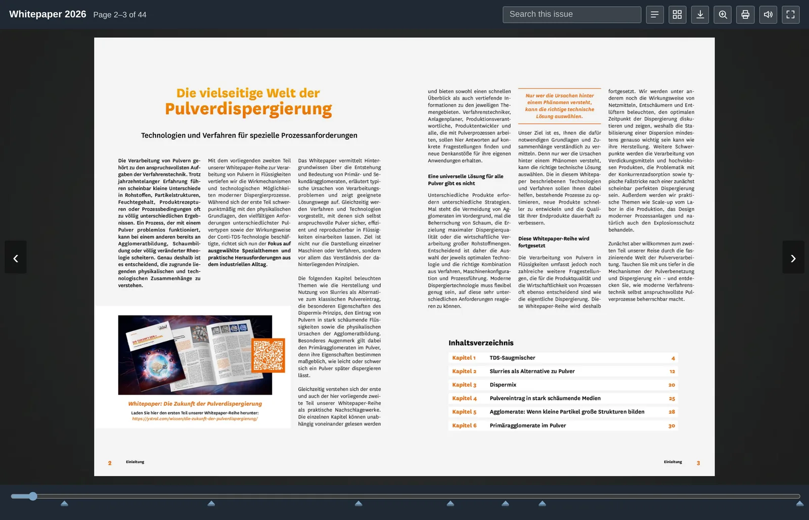
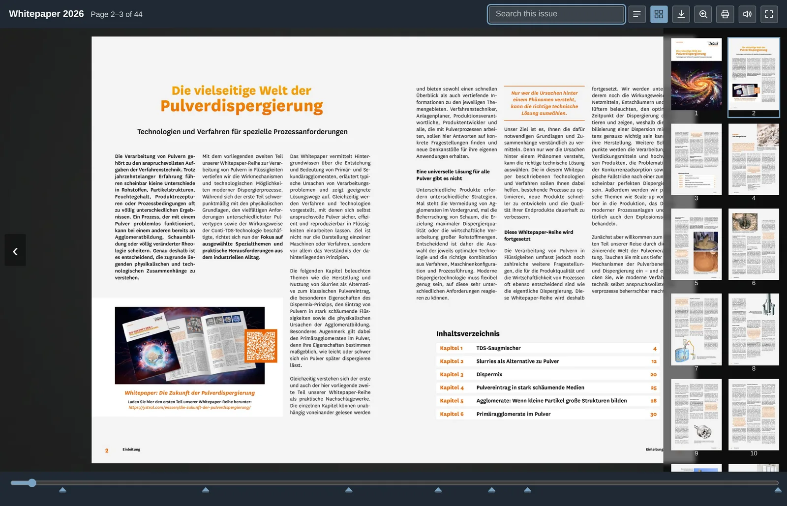

# nt_flippdf

Turns a PDF into a **page-flip edition inside a self-contained directory**: page
images, thumbnails, a full-text index, a viewer and a file to download.

Once built, an edition is nothing but static files. It keeps working whatever
happens to the website around it — after a relaunch, after a TYPO3 upgrade, even
with the extension uninstalled.

## Why not simply link the PDF

A PDF is quickly linked. But whoever clicks it leaves your website, and what
happens next you no longer see: no view, no dwell time, no reason to come back.

A page-flip edition keeps the reader on your page. It reads like a booklet,
carries a full-text search across all pages, a table of contents, a page
overview — and it lies on your server, not with a service that may or may not
still exist in three years.

-   **Full-text search**

    

    Across the whole edition, with a jump straight to the page the hit is on.

-   **Page overview**

    

    Every page as a thumbnail — for readers who know roughly where they were.

## What the viewer offers

Page flipping with the arrow keys, the buttons, by dragging a corner with the
mouse or by swiping on a touch screen; a page slider with chapter marks;
full-text search; table of contents; page overview; zoom; print; download; full
screen; opening in its own window; a page-turn sound; and a switch between
linked language editions.

**At the first and the last page** the viewer says so briefly when someone
tries to turn further — otherwise nothing at all would happen there.

**Getting closer** takes a click in the middle of a page, the wheel, two fingers
on a touch screen, or the button. Clicks near the outer edges keep flipping —
that is where one reaches to turn a page.

**Every one of these can be switched off** — as a default in the extension
configuration, per edition in the backend module, and per content element. The
header buttons come spelled out, as icons only, or as both.

## Requirements

* TYPO3 12.4, 13.4 or 14.x, PHP 8.2 or newer
* **Ghostscript** (`gs`) renders the pages
* **ImageMagick** (`magick` or `convert`) makes the thumbnails
* `pdfinfo` and `pdftotext` from the poppler package are optional; they speed up
  counting pages and improve the full-text search

The backend module checks for these and says what is missing.

## The add-on package

[`nt_flippdf_pro`](https://www.netthinks.com) adds what a gated whitepaper
needs: a preview edition beside the full one, an unguessable address for the
full edition, splitting double pages, watermark, logo and background images,
French and Chinese labels, linked language editions, and counting of views and
downloads.

None of it is needed here — this package is complete on its own.

## In use

[ystral gmbh maschinenbau + processtechnik](https://ystral.com/wissen/wissensportal/whitepaper/die-vielseitige-welt-der-pulverdispergierung/)
publishes its whitepapers this way: a preview of the first pages on the landing
page, the full edition after the registration.
