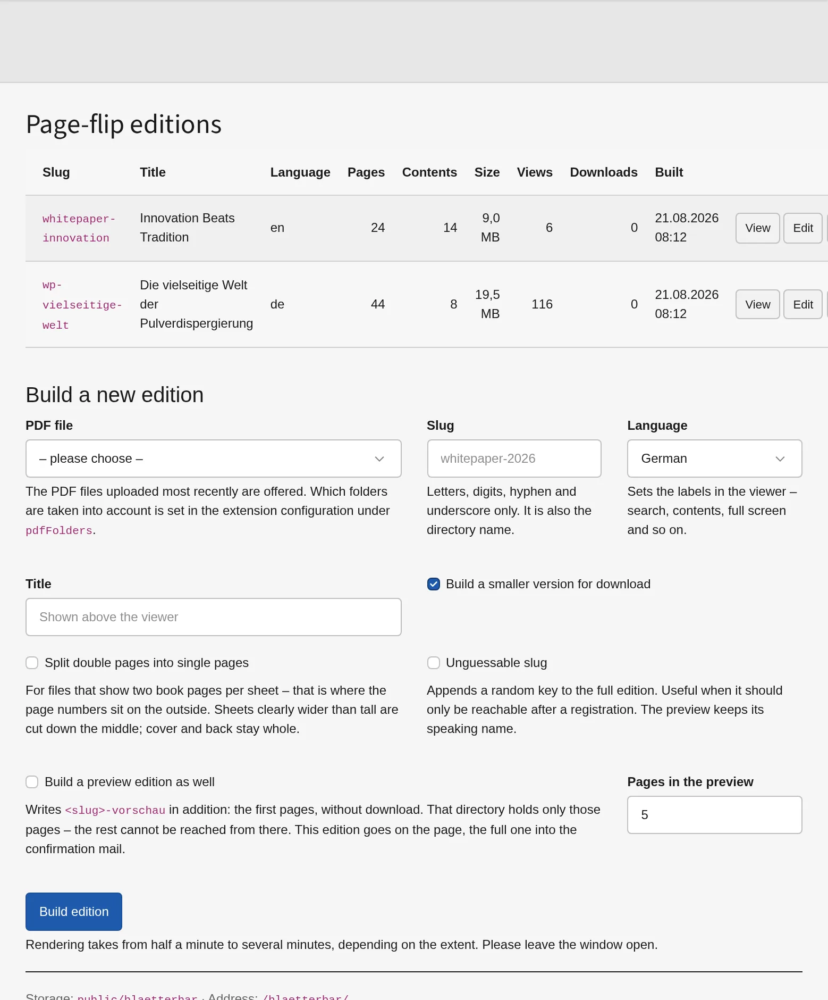
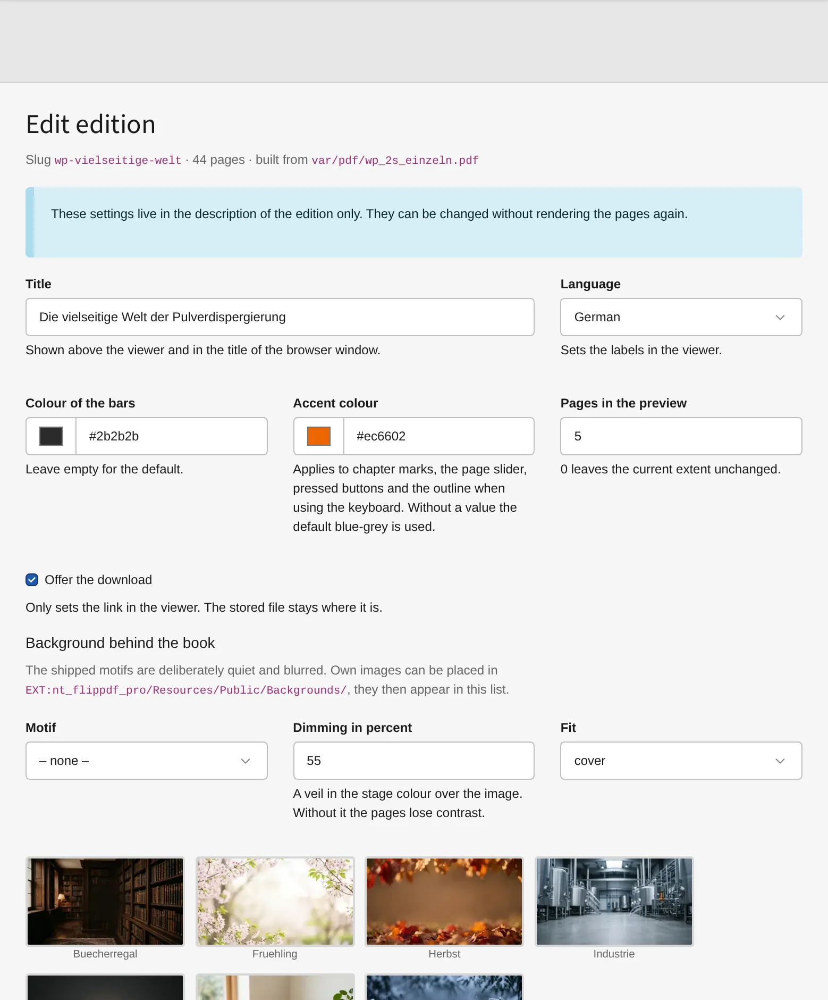

# Building editions



## In the backend

**File → Page-flip editions.** Choose a PDF, give it a slug, choose a language,
press *Build edition*. Rendering takes from half a minute to several minutes,
and a progress bar shows what is happening — the window has to stay open.

The list then holds the edition with page count, table of contents, size, build
date and the actions:

| Action | What it does |
|---|---|
| **View** | opens the edition in a new tab |
| **Edit** | title, language, colours, preview extent, download, controls |
| **Contents** | the table of contents, one line per chapter |
| **Refresh** | brings the edition up to a newer viewer without rendering again |
| **Rebuild** | builds from the same source file, keeping all settings |
| **Delete** | removes the directory |

An edition whose source file has changed since the build is marked *outdated*.

Which folders offer their PDF files is limited by `pdfFolders` in the extension
configuration. Without it, everything in the file storage is offered — in a
grown installation that includes the job applications from the user upload.

## On the command line

```bash
vendor/bin/typo3 flippdf:build <path/to.pdf> <slug> \
    --titel "Title above the viewer" \
    --sprache de
```

| Option | Meaning |
|---|---|
| `--titel` | title above the viewer and in the browser window |
| `--sprache` | `de`, `en`, `fr` or `zh` — the labels in the viewer |
| `--download` | link the download to an existing address instead of writing a file |
| `--ohne-download` | offer no download at all |
| `--farbe-leiste`, `--farbe-akzent` | colours of the bars and of the accents |
| `--vorschau` | how many pages the content element may show at most |
| `--blaetterdauer`, `--ohne-schatten` | flipping speed and shadows |
| `--ohne-zoom`, `--ohne-verweise` | leave out zoom, do not read links from the PDF |
| `--schwester` | link a language edition, `en:slug`, several separated by commas |

The add-on package adds `--vorschau-ausgabe`, `--vorschau-kennung`,
`--zufallskennung` and `--doppelseiten` to the same command.

## Refreshing the viewer

After an update of the extension, existing editions keep running with the viewer
they were built with — it lies inside them. One command brings them up to date
without rendering a single page again:

```bash
vendor/bin/typo3 flippdf:refresh          # all editions
vendor/bin/typo3 flippdf:refresh <slug>   # only this one
```

**Rarely something to remember.** Every edition carries the version of its
viewer. Where it differs from the installed one — or where the viewer files have
changed without the number being raised — the backend module marks the edition
as **viewer old** and offers *Refresh all viewers* at the top.

**It also happens on its own** when the extension is set up: `extension:setup`
takes the existing editions along, so a deployment running that command anyway
leaves nothing to do. A plain `composer update` does not suffice: it only
replaces the files below `vendor`.

## Editing an edition



Title, language, colours, the extent of the preview, the download and every
single control of the viewer — all of it without rendering the pages again.
What is switched off here is removed from the viewer rather than hidden;
otherwise it would still be reachable by keyboard.

## While it is being rebuilt

An edition stays reachable during a rebuild. The new one is built in a directory
beside the old one, and only the last step swaps them — a moment, not the
several minutes a rebuild takes.
